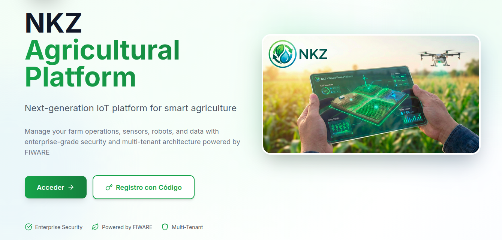
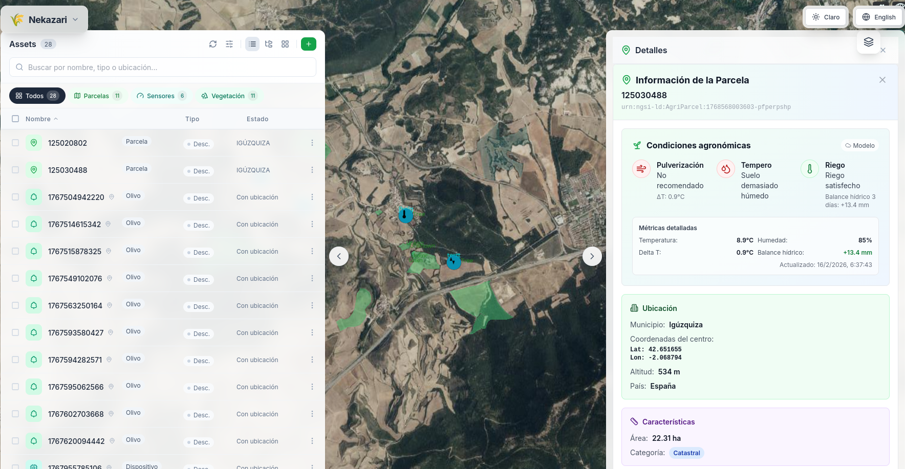
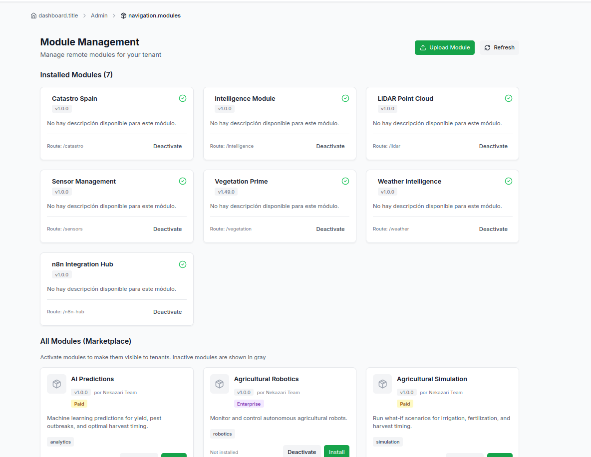
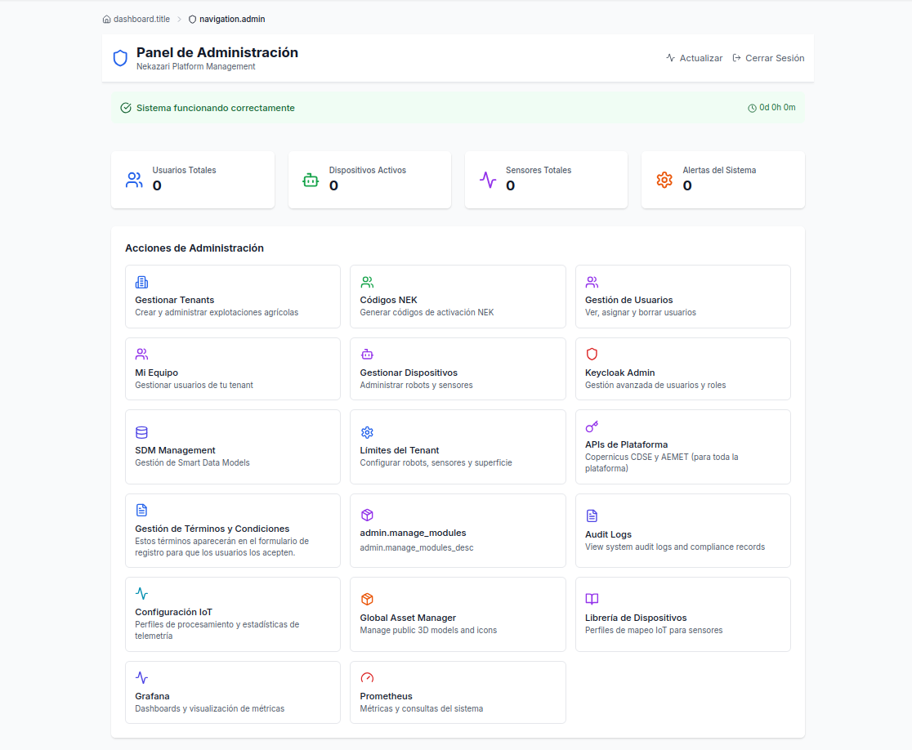

<p align="center">
  
</p>

<h1 align="center">Nekazari</h1>

<p align="center">
  <strong>Open-source operating system for precision agriculture, industry, and environmental sciences.</strong>
</p>

<p align="center">
  <a href="https://github.com/k8-benetis/nkz/actions/workflows/test.yml"></a>
  <a href="https://github.com/k8-benetis/nkz/actions/workflows/docker-build.yml"></a>
  <a href="LICENSE"></a>
  <a href="https://www.npmjs.com/package/@nekazari/sdk"></a>
</p>

---

## Quick Start

```bash
git clone https://github.com/k8-benetis/nkz.git && cd nkz
cp .env.example .env
docker compose up -d          # first build ~10 min (frontend multistage)
# wait ~3 min for healthchecks
open http://localhost:3000     # login: demo@nekazari.local (password in .env)
```

> **Cleanup:** `docker compose down -v` removes all containers and data.

## What is Nekazari?

Nekazari is a **modular, multi-tenant platform** built on [FIWARE NGSI-LD](https://www.fiware.org/) standards. It provides cooperatives, energy companies, and research centers with a single platform to manage:

- **Agricultural operations** — parcels, crops, weather, irrigation, and agronomic risk alerts
- **IoT device fleets** — sensors, drones, tractors (ISOBUS), with real-time telemetry
- **Environmental monitoring** — NDVI vegetation health, LiDAR terrain analysis, carbon tracking
- **Industrial assets** — digital twins, predictive maintenance, ERP integration (Odoo)

Each organization gets its own isolated tenant with role-based access, and can extend the platform through a **module marketplace** — no vendor lock-in.

## Screenshots

<p align="center">
  
</p>

<p align="center">
  <strong>Command Center</strong> — 3D map (CesiumJS), entity tree, and layer management<br />
  
</p>

<p align="center">
  
</p>

<p align="center">
  <strong>Module Marketplace</strong><br />
  
</p>

<p align="center">
  <strong>Admin Panel</strong><br />
  
</p>

## Key Features

| Feature | Description |
|---------|-------------|
| **Digital Twins (NGSI-LD)** | Manage parcels, devices, and assets as interoperable entities via Orion-LD Context Broker |
| **Multi-Tenant Isolation** | Keycloak OIDC, row-level security in PostgreSQL, per-tenant data partitioning |
| **Real-Time Telemetry** | MQTT/HTTP ingestion into TimescaleDB hypertables with sub-second query performance |
| **Agronomic Risk Engine** | Automated hourly evaluation: spray suitability, frost, wind, water stress, GDD pest alerts |
| **Weather Integration** | OpenMeteo and AEMET data with Delta-T and GDD accumulation |
| **3D Geospatial** | CesiumJS viewer with custom layer system, LiDAR 3D tiles, NDVI overlays |
| **Module Marketplace** | Install/uninstall addons per tenant — no rebuild, no redeploy |
| **6 Languages** | Spanish, English, Catalan, Basque, French, Portuguese |

## Module Ecosystem

| Module | Description | Status |
|--------|-------------|--------|
| [DataHub](https://github.com/k8-benetis/nkz-module-data-hub) | Timeseries Data Canvas with multi-series charts | Active |
| [Vegetation Health](https://github.com/k8-benetis/vegetation-health-nkz) | NDVI/vegetation indices from satellite imagery | Active |
| [LiDAR](https://github.com/k8-benetis/nkz-module-lidar) | Point cloud analysis and 3D terrain tiles | Active |
| [Intelligence](https://github.com/k8-benetis/nekazari-module-intelligence) | AI/ML predictive analytics | Active |
| [Connectivity](https://github.com/k8-benetis/nkz-module-conectivity) | Cellular/network monitoring for IoT | Active |
| [Cadastral](https://github.com/k8-benetis/catastro-sp-module-nekazari) | Spanish cadastral registry integration | Active |
| [Robotics](https://github.com/k8-benetis/nkz-module-robotics) | ROS2 + ISOBUS agricultural equipment | Active |
| [Odoo ERP](https://github.com/k8-benetis/nkz-module-odoo) | Enterprise resource planning integration | Active |
| [n8n Workflows](https://github.com/k8-benetis/n8n-module-nkz) | Automation and workflow orchestration | Active |
| Carbon | Carbon footprint tracking | In development |

Modules are independent repos that build to a single IIFE bundle. See the [Module Template](https://github.com/k8-benetis/nkz-module-template) to create your own.

## Architecture

```
                    ┌─────────────────────────────────┐
                    │       Ingress (Traefik/nginx)    │
                    └──────────┬──────────┬────────────┘
                               │          │
                    ┌──────────▼──┐  ┌────▼───────────┐
                    │  Frontend   │  │  API Gateway    │
                    │  (React/TS) │  │  (Flask/Python) │
                    └─────────────┘  └────┬────────────┘
                                          │
         ┌────────────┬───────────┬───────┴────┬──────────────┐
         │            │           │            │              │
    ┌────▼─────┐ ┌────▼────┐ ┌───▼─────┐ ┌───▼──────┐ ┌─────▼──────┐
    │ Entity   │ │ Weather │ │Telemetry│ │ Risk     │ │  Modules   │
    │ Manager  │ │ Worker  │ │ Worker  │ │ Engine   │ │ (Addons)   │
    └────┬─────┘ └────┬────┘ └───┬─────┘ └───┬──────┘ └────────────┘
         │            │          │            │
    ┌────▼────────────▼──────────▼────────────▼──┐
    │  Orion-LD  │  TimescaleDB  │  MongoDB      │
    │  (NGSI-LD) │  (PostgreSQL) │  (Documents)  │
    └─────────────────────────────────────────────┘
```

## For Developers

### Create a Module

```bash
# Use the template
git clone https://github.com/k8-benetis/nkz-module-template.git my-module
cd my-module && npm install
npm run dev        # local development with hot reload
npm run build      # produces dist/nkz-module.js (IIFE bundle)
```

Modules self-register at runtime via `window.__NKZ__.register()` and receive shared dependencies (React, Router, SDK, UI Kit) from the host — no build-time coupling.

- [External Developer Guide](docs/development/EXTERNAL_DEVELOPER_GUIDE.md) — full walkthrough
- [Module Architecture](docs/architecture/MODULE_SYSTEM_ARCHITECTURE.md) — slot system, registration
- [@nekazari/sdk](https://www.npmjs.com/package/@nekazari/sdk) (v1.0.3) — auth, i18n, API client
- [@nekazari/ui-kit](https://www.npmjs.com/package/@nekazari/ui-kit) (v1.0.0) — shared components

### API Integration

```bash
# REST API (local docker-compose)
curl -b nkz_token=... http://localhost:3000/api/entities

# Device telemetry (MQTT)
mosquitto_pub -h localhost -t "nekazari/demo-farm/telemetry" -m '{"temperature": 22.5}'
```

- [API Getting Started](docs/api/01-getting-started.md)
- [Authentication](docs/api/02-authentication.md)
- [Device Integration](docs/api/devices/)

## Tech Stack

| Layer | Technology |
|-------|-----------|
| Frontend | React 18, TypeScript 5, Vite 5, Tailwind CSS, CesiumJS |
| Backend | Python (Flask, FastAPI), Gunicorn |
| Data | FIWARE NGSI-LD (Orion-LD), PostgreSQL/TimescaleDB, MongoDB, Redis |
| Auth | Keycloak 26 (OIDC/OAuth2, RS256 JWKs, multi-tenant) |
| Messaging | MQTT (Mosquitto), Redis queues |
| Infrastructure | Kubernetes (K3s), Traefik, cert-manager, MinIO |
| i18n | react-i18next (ES, EN, CA, EU, FR, PT) |

## Repository Structure

```
apps/host/          React frontend (Vite, CesiumJS, Tailwind)
services/           Python microservices (Flask, FastAPI)
  api-gateway/      JWT validation, rate limiting, FIWARE headers
  entity-manager/   NGSI-LD CRUD, module marketplace, S3 uploads
  risk-*/           Agronomic risk evaluation engine
  weather-worker/   Meteorological data ingestion
  ...
config/             TimescaleDB migrations, monitoring configs
k8s/                Kubernetes manifests
docker/             docker-compose support files
docs/               Platform documentation
packages/           @nekazari/sdk, @nekazari/ui-kit, module-builder
```

## Contributing

We welcome contributions. See [CONTRIBUTING.md](CONTRIBUTING.md) for guidelines.

## License

- **Platform (this repo):** [GNU Affero General Public License v3.0](LICENSE)
- **SDK + UI Kit:** Apache License 2.0
