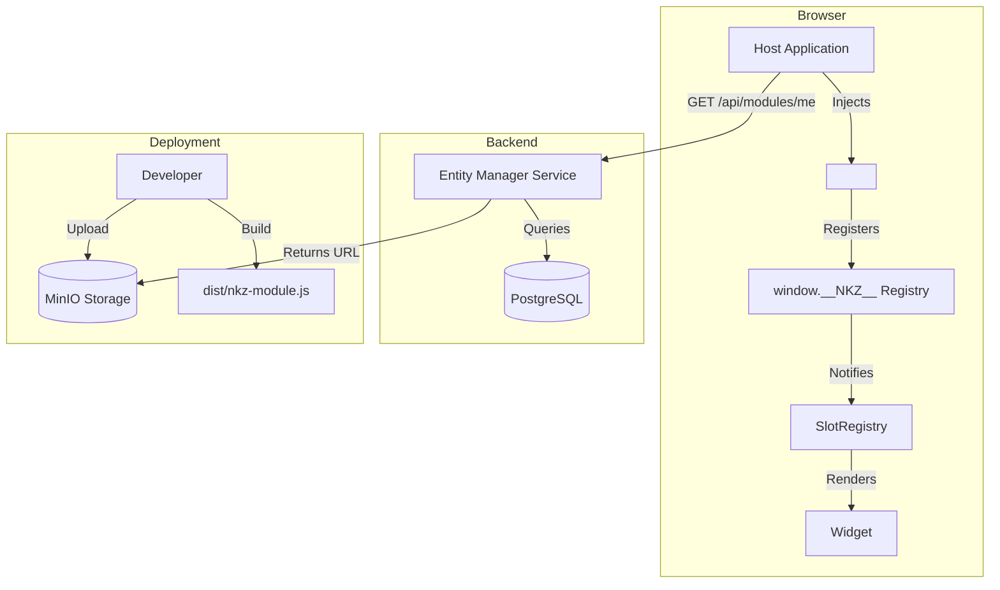

# Nekazari Module System Architecture

> **Version**: 2.0 (Runtime IIFE)
> **Status**: Production
> **Updated**: 2026-02-16

## Overview

The Nekazari Module System allows third-party extensions to be loaded into the host application at runtime without rebuilding the host.

### Key Principles

1.  **Decoupling**: Modules are built and deployed independently.
2.  **Security**: Modules run in the strict context of the host (Keycloak auth, CORS).
3.  **Performance**: Modules are loaded on demand via `<script>` tags.
4.  **Consistency**: Shared dependencies (`React`, `SDK`, `UI-Kit`) ensure a unified look and feel.

## Architecture Diagram

## Comparisons

| Feature | Old (Module Federation) | New (Runtime IIFE) |
|---------|-------------------------|--------------------|
| **Build Tool** | `@originjs/vite-plugin-federation` | `vite build --target lib` (IIFE) |
| **Loading** | `import()` (async ES modules) | `<script>` tag injection |
| **Registration** | Complex unwrapping of remote slots | `window.__NKZ__.register()` |
| **Shared Deps** | Federation negotiation (fragile) | `window` globals (robust) |
| **Deployment** | Separate Services/Ingresses | Static files on MinIO |

## Data Model

Modules are tracked in the `marketplace_modules` table:

- `id`: Unique identifier (e.g., `catastro-spain`)
- `remote_entry_url`: Path to the bundle (e.g., `/modules/catastro-spain/nkz-module.js`)
- `required_roles`: Array of Keycloak roles allowed to view.

## Module Lifecycle

1.  **Discovery**: Host calls `/api/modules/me` to get list of active modules.
2.  **Loading**: `ModuleContext` component iterates list and appends `<script>` tags to `document.body`.
3.  **Registration**:
    - Script executes immediately (IIFE).
    - Calls `window.__NKZ__.register({ id, viewerSlots, ... })`.
    - `nkzRuntime` emits `moduleRegistered` event.
4.  **Rendering**:
    - `SlotRegistry` listens to event.
    - Updates React state with new slots.
    - Components (e.g. `MapParams`) re-render with new widgets.
5.  **Unloading**:
    - On unmount, scripts are removed (optional, usually kept for caching).

## Developer Workflow

See [ADDON_DEVELOPMENT_GUIDE](../development/ADDON_DEVELOPMENT_GUIDE.md).

1.  Use `@nekazari/module-builder` preset.
2.  Define slots in `src/moduleEntry.ts`.
3.  Build to `dist/nkz-module.js`.
4.  Upload to MinIO.
